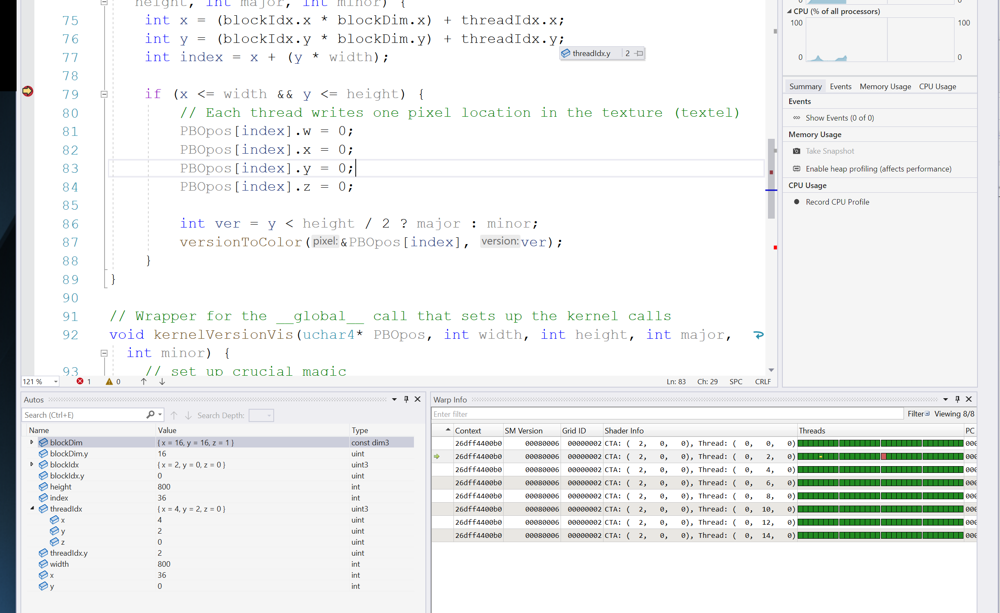
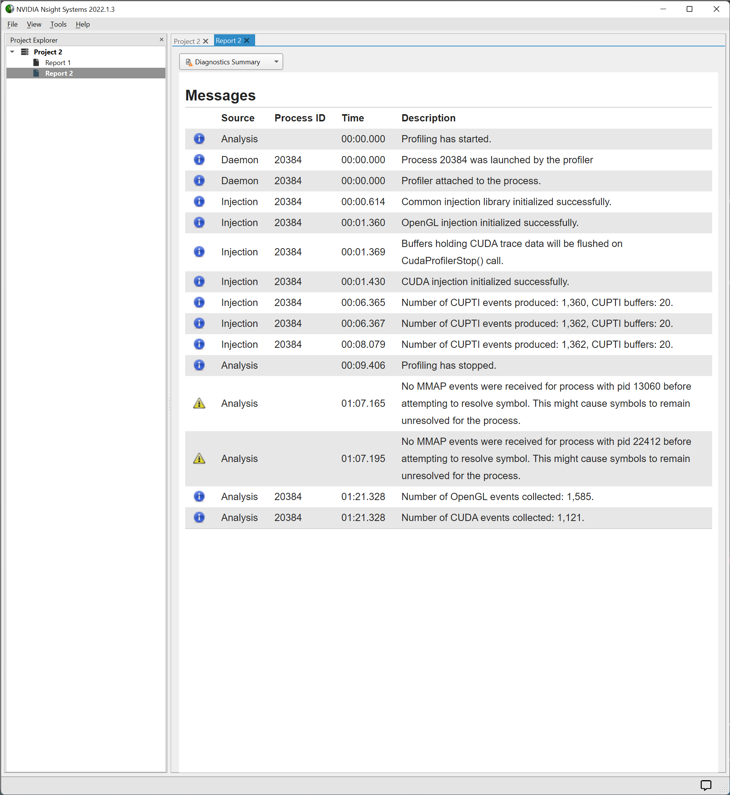

Project 0 Getting Started
====================

**University of Pennsylvania, CIS 565: GPU Programming and Architecture, Project 0**

* Marshall Wang
  * [LinkedIn](http://linkedin.com/in/marshall-wang-256)
* Tested on: Windows 11, AMD Ryzen9 5900HS @ 3.30GHz 16GB, RTX 3070 Laptop 8192MB

### Unresolved questions

Include screenshots, analysis, etc. (Remember, this is public, so don't put
anything here that you don't want to share with the world.)

* It seems that the value `x, y, index` displayed might not always be correct? Like below, where `y` should be `2` but `0`.

* What does the warning `No MMAP events received` mean?

